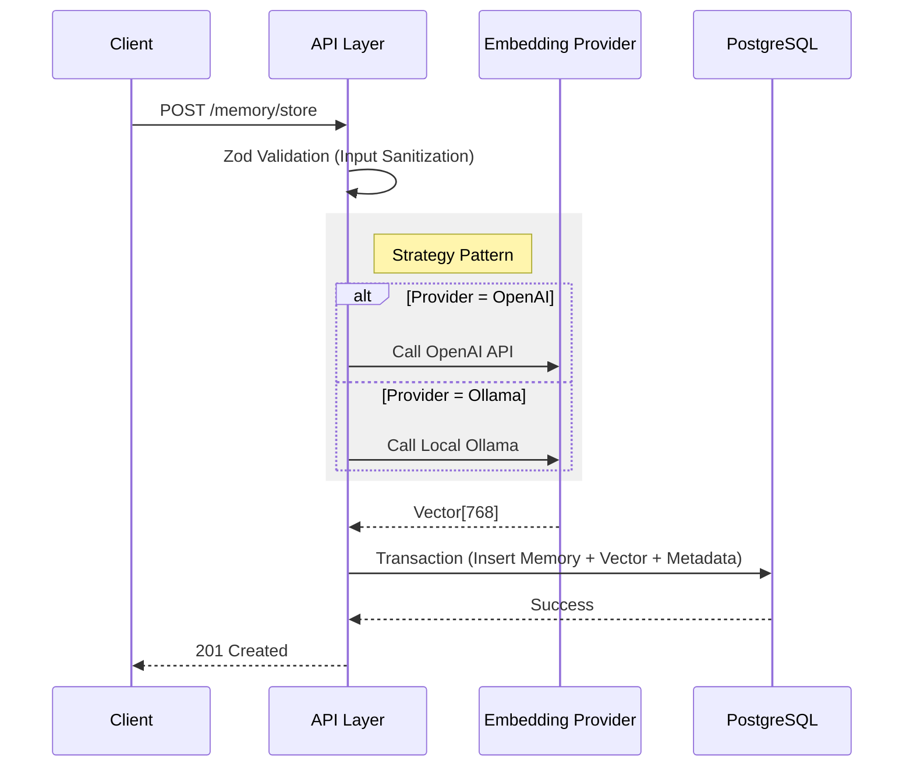

# MemVault Architecture Documentation

> **The "External Hard Drive" for AI Agents**

This document serves as the technical source of truth for **MemVault**. It outlines the design philosophy, architectural decisions, and the sophisticated retrieval engine that powers this self-hostable Memory-as-a-Service API.

---

## 1. Design Philosophy

MemVault was built to solve the "Context Window Problem" without the bloat of complex agent frameworks.

### Pragmatism over Complexity
Many memory systems attempt to be an entire "Operating System" for agents (like MemGPT), managing control flow, tools, and recursive thought loops. **MemVault takes a different approach.**

We act as a simple, dumb, but highly efficient **External Hard Drive**.
*   **We do not** manage your agent's loop.
*   **We do not** execute code.
*   **We do** store and retrieve information with extreme precision.

This "API Wrapper" approach allows MemVault to be dropped into *any* existing agent stack (LangChain, AutoGen, or raw Python scripts) without refactoring the agent's core logic.

### Local-First & Offline Capable
Privacy and cost are major barriers to AI adoption. MemVault is designed to run **100% Offline**.
*   By integrating with **Ollama**, we support local embedding generation (using `nomic-embed-text`).
*   The entire stack (DB, API, Visualizer) runs in Docker, making it air-gap friendly.

---

## 2. The Tech Stack

| Component | Choice | Rationale |
| :--- | :--- | :--- |
| **Runtime** | **Node.js & TypeScript** | Node.js excels at I/O-bound tasks like API proxying. TypeScript provides strict type safety, critical when handling 768-dimensional vector arrays to prevent runtime math errors. |
| **Database** | **PostgreSQL + `pgvector`** | We bypass standard ORM methods for retrieval. Instead, we use **Native SQL (`$queryRaw`)** to leverage PostgreSQL's advanced features: `tsvector` for full-text search and `vector` operations in a single, high-performance query. |
| **ORM** | **Prisma** | Used for schema management, migrations, and type-safe CRUD operations (creating/updating memories), while raw SQL handles the complex retrieval logic. |
| **Visualizer** | **React + `react-force-graph-2d`** | A custom "Neural Node" rendering engine visualizes the memory space in real-time, allowing developers to debug how memories cluster semantically. |

---

## 3. The Retrieval Engine (Hybrid Search 2.0)

The core value of MemVault is its retrieval accuracy. We do not rely solely on Vector Search, which often fails at exact keyword matching (e.g., distinguishing "Error 404" from "Error 500").

We utilize a **Hybrid Scoring Algorithm** that combines three distinct signals into a single relevance score.

### The Formula
$$ \text{FinalScore} = (S \times 0.5) + (K \times 0.3) + (R \times 0.2) $$

### Component 1: Semantic Similarity ($S$)
*   **Technology:** `pgvector` (Cosine Distance)
*   **Role:** Understands the *meaning* and *intent* behind the query.
*   **Example:** A query for "fruit" matches a memory about "apples" even if the word "fruit" is missing.

### Component 2: Exact Match / Keyword Rank ($K$)
*   **Technology:** PostgreSQL `tsvector` & `BM25` (via `ts_rank`)
*   **Role:** Captures specific identifiers, names, or error codes.
*   **Example:** A query for "ID-1234" will strongly prioritize memories containing that exact string, overriding vague semantic matches.

### Component 3: Temporal Decay ($R$)
*   **Technology:** Custom Decay Function
*   **Role:** Prioritizes recent context to prevent "Contextual Drift."
*   **Logic:** Information from 5 minutes ago is usually more relevant to the immediate conversation than information from 5 months ago, unless the semantic match is overwhelming.

---

## 4. Data Flow & Architecture

### Ingestion Pipeline
The write path is designed for data integrity and idempotency.

### Provider Pattern
The system uses a strict `EmbeddingProvider` interface to allow hot-swapping of "brains."
*   **Cloud Mode:** Uses `OpenAIEmbeddingProvider` (High accuracy, paid).
*   **Local Mode:** Uses `OllamaProvider` (Private, free).
*   **Configuration:** Switched instantly via the `EMBEDDING_PROVIDER` environment variable.

---

## 5. Security & Scalability

*   **Authentication:** Admin-level access is secured via `ADMIN_API_KEY` middleware.
*   **Rate Limiting:** Built-in protection against DoS attacks using a sliding window algorithm.
*   **Input Sanitization:** All incoming JSON bodies are strictly validated against Zod schemas to prevent injection attacks or malformed data.
*   **Indexing:** We utilize **HNSW (Hierarchical Navigable Small World)** indexes for vector fields. This enables approximate nearest neighbor search, allowing the system to scale to millions of memories with sub-millisecond retrieval times.