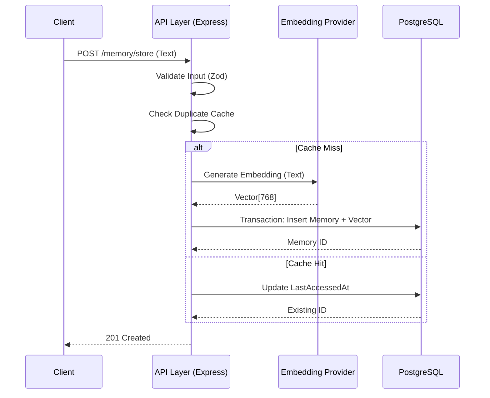

# MemVault Architecture Documentation

> **Pragmatic Memory-as-a-Service for AI Agents**

This document serves as the technical source of truth for **MemVault**. It outlines the design philosophy, architectural decisions, and core systems that power this self-hostable RAG (Retrieval-Augmented Generation) solution.

---

## 1. Design Philosophy

MemVault was born out of "boilerplate fatigue." Every AI agent project starts with the same friction: setting up a vector database, writing chunking logic, handling embedding API failures, and managing context windows.

Our philosophy is **Pragmatism over Complexity**.

*   **Monolith by Design:** We deliberately chose a monolithic API wrapper approach. Microservices introduce network latency and deployment complexity that is unnecessary for 99% of RAG use cases. MemVault is a single Docker container you can spin up anywhere.
*   **Database Convergence:** Instead of maintaining a relational DB (Postgres) *and* a vector DB (Pinecone/Weaviate), we use **PostgreSQL for everything**. This reduces operational overhead and ensures transactional integrity between metadata and vectors.
*   **True Local First:** While we support OpenAI, MemVault is designed to run 100% offline using Ollama. Privacy and cost-control are first-class citizens, not afterthoughts.

---

## 2. The Tech Stack (Decision Log)

| Component | Choice | Rationale |
| :--- | :--- | :--- |
| **Runtime** | **Node.js & TypeScript** | Node.js handles I/O-heavy workloads (like API proxying) efficiently. TypeScript provides strict type safety, which is critical when handling complex vector arrays (e.g., `number[]` of length 768) to prevent runtime math errors. |
| **Database** | **PostgreSQL + `pgvector`** | We rejected specialized vector DBs in favor of Postgres. **Why?** <br>1. **ACID Compliance:** Metadata updates and vector insertions happen in the same transaction.<br>2. **Hybrid Search:** We can combine vector similarity with standard SQL `WHERE` clauses (filtering by `sessionId`, `timestamp`) and Full-Text Search (`tsvector`) efficiently.<br>3. **Cost:** No extra infrastructure bill; it runs on standard RDS or a $5 VPS. |
| **ORM** | **Prisma** | Prisma provides a type-safe interface to the database, making schema migrations (like adding vector dimensions) predictable and safe. |
| **Visualizer** | **React + `react-force-graph-2d`** | A built-in dashboard allows developers to "see" their agent's memory. We use force-directed graphs to visualize how memories cluster semantically, aiding in debugging "hallucinations." |

---

## 3. Core Systems & Data Flow

### 3.1 Ingestion Pipeline

The ingestion process is designed to be fail-safe and idempotent.



### 3.2 Hybrid Retrieval Algorithm

Retrieval is not just about finding the "closest" vector. A memory from 3 years ago is likely less relevant than one from 5 minutes ago, even if the wording is identical.

We use a **Weighted Scoring Formula** to rank memories:

$$ \text{FinalScore} = (S \times W_s) + (K \times W_k) + (R \times W_r) + (I \times W_i) $$

Where:
*   **$S$ (Semantic Similarity):** Cosine similarity from `pgvector` (0.0 to 1.0). Measures *meaning*.
*   **$K$ (Keyword Rank):** PostgreSQL `ts_rank` normalized. Measures *exact matches* (e.g., error codes, IDs).
*   **$R$ (Recency Decay):** A function that decays score based on `createdAt`. Prevents **Contextual Drift** by prioritizing fresh information.
*   **$I$ (Importance):** A manual override score (0.0 to 1.0) assigned by the agent to "pin" critical memories (e.g., "User's name is Alice").

---

## 4. Provider Architecture (The "Brain")

MemVault uses the **Strategy Pattern** to handle embeddings. This allows the "brain" of the system to be swapped via environment variables without code changes.

### The Interface
All providers must implement the `EmbeddingProvider` interface:

```typescript
interface EmbeddingProvider {
  generateEmbedding(text: string): Promise<number[]>;
  isEnabled(): boolean;
}
```

### Implementations

1.  **`OpenAIEmbeddingProvider`**:
    *   Uses `text-embedding-3-small`.
    *   Best for production accuracy and multilingual support.
    *   Requires `OPENAI_API_KEY`.

2.  **`OllamaProvider`**:
    *   Connects to a local Ollama instance.
    *   Default model: `nomic-embed-text` (768 dimensions).
    *   **Zero Latency Cost:** Ideal for local development or air-gapped environments.
    *   Activated by setting `EMBEDDING_PROVIDER=ollama`.

---

## 5. Security & Scalability

### Security
*   **Authentication:** The API is protected by a Bearer Token system (`ADMIN_API_KEY`). Middleware validates this token before any controller logic executes.
*   **Input Sanitization:** All inputs are validated via `Zod` schemas. SQL injection is prevented by Prisma's parameterized queries and strict typing.
*   **CORS:** Configurable CORS policies ensure only authorized frontends (like the visualizer) can access the API.

### Scalability
*   **Indexing:** We utilize **HNSW (Hierarchical Navigable Small World)** indexes via `pgvector`. This allows for approximate nearest neighbor search, which is orders of magnitude faster than exact search (IVFFlat) as the dataset grows to millions of vectors.
*   **Pruning:** A background job (configurable via cron) automatically "forgets" low-importance, old memories to keep the database performant and the context relevant.

---

## 6. Future Roadmap

*   [ ] **Multi-Tenancy:** Support for multiple distinct "Agents" with isolated memory spaces.
*   [ ] **GraphRAG:** Implementing knowledge graph edges between memories for multi-hop reasoning.
*   [ ] **Binary Quantization:** Reducing vector size for 10x faster search at scale.
